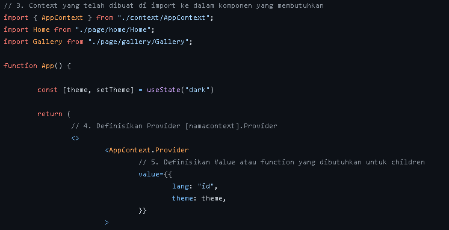

# Context
<p align=center>

</p>

* Context adalah  Salah satu state Management yg di khususkan buat React Js serta mengelola state secara global pula, dapat di gunakan bersama useState Hook untuk berbagai state.


## Cara Menggunakan Context
* Buat Sebuah Folder context di dalam folder src dan di dalam folder tersebut terdapat file dengan nama __<AppContext.js>__ 
```
// 1. Import React Library
import React from "react"

// 2. Definisikan variable dengan assign value React.createContext()
export const AppContext = React.createContext()
```

* Lalu beralih ke __<App.js>__ dan jangan lupa ,mengimport Home dan file-file yg kita butuhkan.

<p align="center">

</p>

* buat sebuah folder __components__ dan di dalamnya ada folder __navbar__ lalu di dalam folder navbar ada file __<Navbar.jsx>__

<p align="center">

</p>

# React Testing

* __React Testing__ adalah seperangkat helpers yang memungkinkan Anda mengetes komponen pada React tanpa bergantung pada detail implementasinya. testing dapat dilakukan dengan menggunakan JEST